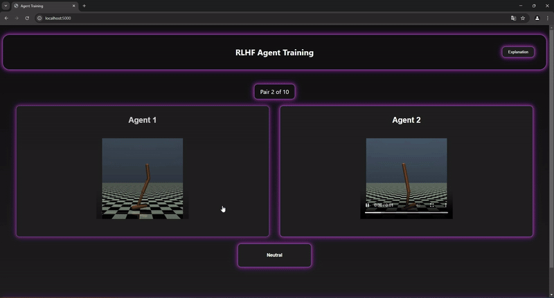

# PEBBLE RLHF Framework (with Human or Synthetic Feedback)

[PEBBLE](https://arxiv.org/abs/2106.05091) is an off-policy reinforcement learning (RL) algorithm that uses unsupervised Learning and relabeling to 
solve complex RL tasks. Our project uses the PEBBLE algorithm to solve problems in continuous space, 
specifically in the [MuJoCo](https://gymnasium.farama.org/environments/mujoco/) gym environments. 

As the foundation of our algorithm, we used the off-policy Soft Actor-Critic (SAC) algorithm
implemented and found in the [CleanRL](https://github.com/vwxyzjn/cleanrl) Deep Reinforcement Learning library.



## Features
+ Solving tasks in the MuJoCo environmental
+ Support for different sampling methods: ensemble-based or uniform-based sampling
+ Switching between human feedback and synthetic feedback
+ Intuitive user interface for the human feedback mode
  + Selecting between two trajectory pairs or choose a neutral option
  + Setting preferences

## Get Started
**Prerequisites:**
* Python >=3.7.1,<3.11
* [Poetry 1.2.1+](https://python-poetry.org)

## Using the Project Locally:
```bash
# Clone the repository
git clone https://gitlab2.cip.ifi.lmu.de/plankm/sep-groupb.git
cd sep-groupb

# Install dependencies with Poetry
poetry install

# If multiple python versions are installed, use the Poetry virtual environment with Python 3.10
poetry env use python
```
## Running the Program in the Terminal:
```bash
# Starting with default values
# Add arguments to change values
poetry run main.py --total_timesteps 10000

#Default settings:
# - Synthetic feedback: False
# - Ensemble sampling: True                     
```
## Feedback Configuration
When running the program with synthetic_feedback = False, a trajectory pair is sent to the UI. After
providing feedback, wait for new videos to render. To switch modes, navigate to the
\rlhf folder and configure the settings in args.py.

## Credits
This project was developed by: 
+ Aleksandar Mijatovic
+ Martin Plank
+ Thang Long Nguyen
+ Tobias Huber
+ Yusuf Malik Durmus

## Citation
As previously mentioned, an implementation of SAC was used. This implementation can be found in the CleanRL 
Deep Reinforcement Learning library.

```bibtex
@article{huang2022cleanrl,
  author  = {Shengyi Huang and Rousslan Fernand Julien Dossa and Chang Ye and Jeff Braga and Dipam Chakraborty and Kinal Mehta and João G.M. Araújo},
  title   = {CleanRL: High-quality Single-file Implementations of Deep Reinforcement Learning Algorithms},
  journal = {Journal of Machine Learning Research},
  year    = {2022},
  volume  = {23},
  number  = {274},
  pages   = {1--18},
  url     = {http://jmlr.org/papers/v23/21-1342.html}
}
```

## Project Status
This project will no longer be maintained or supported after February 7, 2025.
